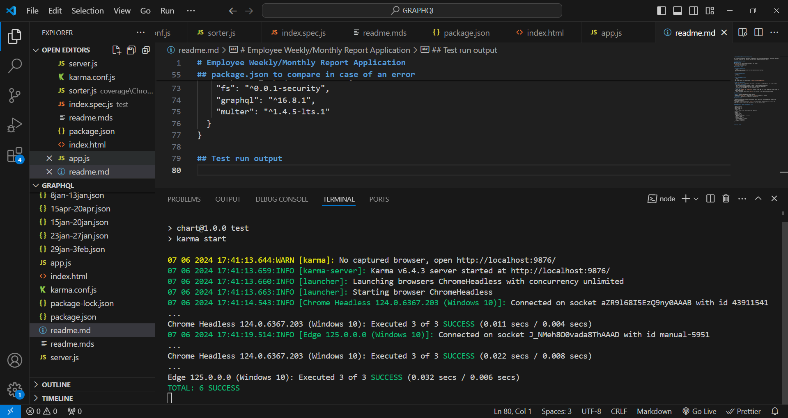
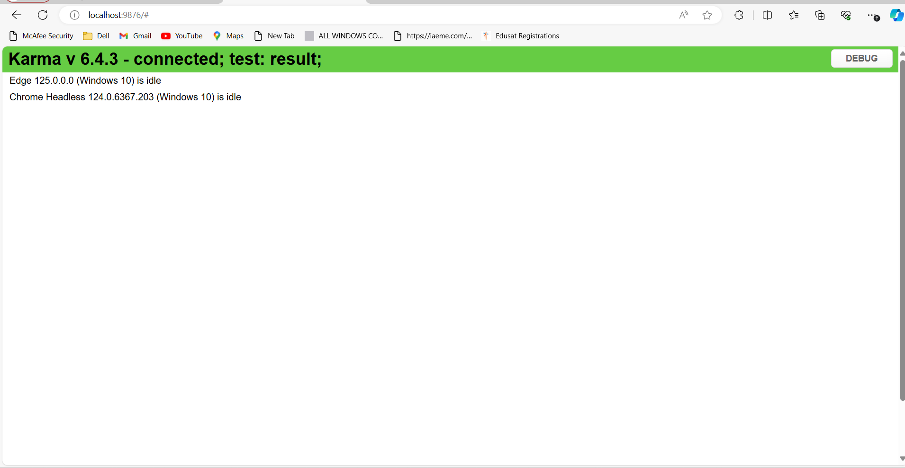
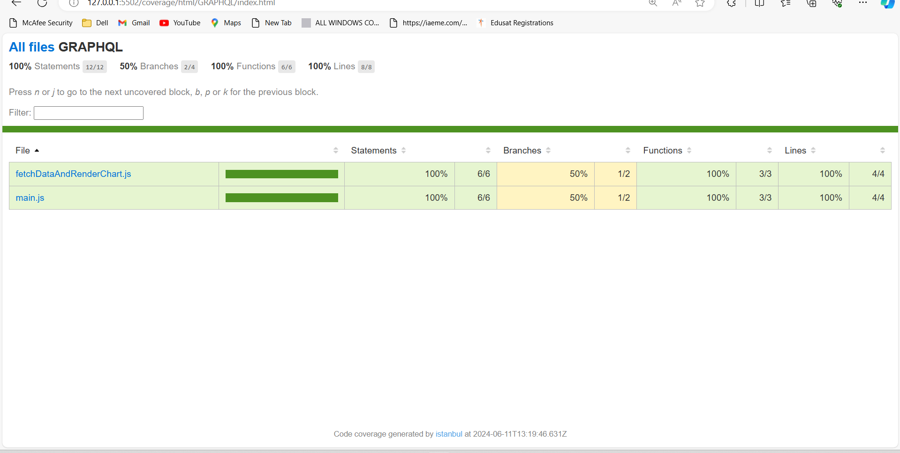

# Employee Weekly/Monthly Report Application

This project is a simple web application for generating and visualizing weekly/monthly  reports for employees. It utilizes GraphQL for data retrieval and Chart.js for rendering interactive charts.

## Step-by-Step Setup Guide

### Prerequisites
Make sure you have the following installed on your system:
- [Node.js](https://nodejs.org/)
- [npm](https://www.npmjs.com/)

### Installation Steps

1. **Clone the Repository**
   ```bash
   git clone https://github.com/your-username/employee-weekly-report.git
   cd employee-weekly-report
   ```

2. **Install Dependencies**
   ```bash
   npm install
   ```

3. **Run the GraphQL Server**
   ```bash
   npm start
   ```
   The GraphQL server will start running at `http://localhost:3000/graphql`.

4. **Open the Application**
   Open `index.html` in a web browser. You can use a local server or simply open the file in your browser.

5. **Explore the Application**
   - The application provides a dropdown to select a specific week and an employee.
   - Charts are dynamically generated based on the selected week and employee.
   - The monthly chart aggregates data for the selected month.

6. **Customization**
   - Modify the `maxWeeks` and `maxEmployees` constants in the HTML file to set the desired maximum number of weeks and employees.
   - Adjust the GraphQL queries in the `app.js` file according to your data structure if needed.

### Folder Structure

- **data:** Contains sample data for weekly reports.
- the HTML file (`index.html`), JavaScript file (`app.js`), and Chart.js library.
- **server.js:** Implements the GraphQL server with Express.

### Additional Notes

- The application assumes a specific structure for weekly report data, including employee numbers, week numbers, and task details.
- The GraphQL schema and resolvers in `server.js` can be customized based on your data structure and requirements.
- Feel free to extend or modify the application to suit your specific needs.

## package.json to compare in case of an error 
{
  "name": "chart",
  "version": "1.0.0",
  "description": "",
  "main": "index.js",
  "scripts": {
    "test": "echo \"Error: no test specified\" && exit 1"
  },
  "keywords": [],
  "author": "",
  "license": "ISC",
  "dependencies": {
    "@graphql-tools/schema": "^10.0.2",
    "chart.js": "^4.4.1",
    "cors": "^2.8.5",
    "express": "^4.18.2",
    "express-graphql": "^0.12.0",
    "fs": "^0.0.1-security",
    "graphql": "^16.8.1",
    "multer": "^1.4.5-lts.1"
  }
}

## Test run output 
- Inside test folder - index.spec.js 
These tests ensure that critical frontend functionalities such as file upload, visualization, and dropdown population are working as expected. Additional tests can be added to cover other functionalities and edge cases, ensuring comprehensive test coverage for the frontend code.





